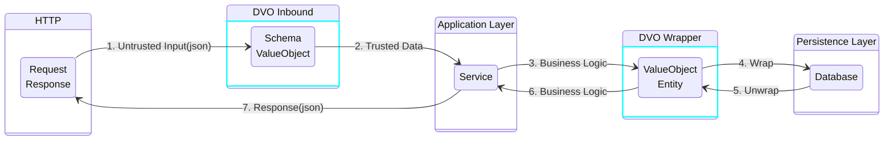

<p align="center">
  Declarative Value Object (DVO)
  <br/>
  <br/>
  <a href="https://github.com/kcmvp/dvo/blob/main/LICENSE">
    
  </a>
  <a href="https://goreportcard.com/report/github.com/kcmvp/dvo">
    
  </a>
  <a href="https://pkg.go.dev/github.com/kcmvp/dvo">
    
  </a>
  <a href="https://github.com/kcmvp/archunit/blob/main/.github/workflows/build.yml" rel="nofollow">
     
  </a>
  <a href="https://app.codecov.io/gh/kcmvp/dvo" ref="nofollow">
    
  </a>

</p>

**dvo** is a powerful, source-agnostic validation framework for Go that eliminates redundant and scattered validation logic.

We've all felt the pain. For one endpoint, you're meticulously adding struct tags to a JSON request body. For another, you're writing a tangled web of `if/else` statements to validate URL query parameters. The logic for validating the same piece of data, like a user ID, ends up duplicated in multiple places. When a rule changes, you have to hunt down every instance, hoping you don't miss one. This is brittle, error-prone, and doesn't scale.

**dvo** solves this by creating a single source of truth. It provides a fluent, declarative API to build reusable validation schemas (`ValueObject`) that are completely decoupled from the data's origin. You define the validation rules for a concept like 'username' or 'paging' once, and then apply that schema to request bodies, query parameters, or any other data source. This is the core principle of **dvo**: centralize your validation logic, simplify maintenance, and build dramatically more robust and reliable APIs.

## Goal

The primary challenge in modern application development is not just handling data, but managing the explosion of data structures. For each business scenario, we often create a new, slightly different struct, leading to an unmanageable number of similar-yet-distinct types.

**dvo** solves this by establishing a clear boundary and a single source of truth for your data contracts. It acts as a gatekeeper for both incoming and outgoing data, ensuring its integrity and structure.

This diagram illustrates the two primary data flows where `dvo` provides significant value:



1.  **Inbound Data Validation (Top Flow)**: For incoming data (e.g., an HTTP request), `dvo` validates the **untrusted input** against a `Request Schema`. On success, it produces a **trusted `ValueObject`** that your service layer can safely consume before interacting with the database.
2.  **Outbound Data Guarantee (Bottom Flow)**: When retrieving data (e.g., from a database), `dvo` can validate your entity against a `Response Schema`. This guarantees that the data you send back to the client strictly adheres to your API's **data contract**, preventing accidental leakage of internal fields or malformed responses.

## Features

- **Declarative API:** Define validation schemas for your request data in a clear, readable, and reusable way.
- **Framework Middleware:** Out-of-the-box integration with Gin, Echo, and Fiber.
- **Extensible Enrichment:** A powerful "Global Enricher" pattern to inject common data (e.g., user info from an auth middleware) into your validated objects automatically.
- **Nested Validation:** Easily validate complex structures including nested objects, arrays of primitives, and arrays of objects.
- **Type-Safe Access:** The validation layer ensures data types are correct before your handler logic runs.
- **Common Constraints:** Includes a set of common validation constraints like `Gt`, `MinLength`, `Pattern`, and more.

## Installation

```bash
go get github.com/kcmvp/dvo
```

## Core Concepts

The library revolves around the `ValueObject`, which acts as a reusable validation schema for your request data. You define the schema by composing `Field` definitions, each with its own type and validation constraints.

A `ValueObject` is typically defined once at the package level and reused across different handlers.

```go
import (
    "time"
    "github.com/kcmvp/dvo"
    "github.com/kcmvp/dvo/constraint"
)

// 1. Define a schema for a single item within an order.
var orderItem = dvo.WithFields(
    dvo.Field[string]("ProductID", constraint.MinLength(1)),
    dvo.Field[string]("ProductName", constraint.MinLength(1)),
    dvo.Field[int]("Quantity", constraint.Gt(0)),
    dvo.Field[float64]("Price", constraint.Gt(0.0)),
)

// 2. Define the main order schema, embedding an array of order items.
// This schema is reusable and can be passed to the validation middleware.
var orderVO = dvo.WithFields(
    dvo.Field[string]("OrderID"),
    dvo.Field[string]("CustomerID"),
    dvo.Field[time.Time]("OrderDate"),
    dvo.Field[float64]("Amount", constraint.Gt[float64](0)),
    dvo.Field[int]("Priority").Optional(), // This field is not required
    dvo.Field[bool]("Shipped"),
    // Embed the orderItem schema as an array.
	dvo.ArrayOfObjectField("Items", orderItem),
)
```

## Generic Validator

`dvo` comes with a rich set of built-in, generic validators that you can apply to your fields. These validators cover common use cases for strings, numbers, booleans, and time values.

Here’s how you can apply multiple constraints to a single field:

```go
import (
    "github.com/kcmvp/dvo"
    "github.com/kcmvp/dvo/constraint"
)

var profileVO = dvo.WithFields(
    // Apply MinLength and MaxLength to the 'username' field.
    dvo.Field[string]("username",
        constraint.MinLength(3),
        constraint.MaxLength(50),
    ),

    // Apply Gt (Greater Than) to the 'age' field.
    dvo.Field[int]("age", constraint.Gt(18)),

    // Validate that a value is one of the allowed options.
    dvo.Field[string]("role", constraint.OneOf("admin", "member", "guest")),
)
```

### Common Built-in Validators

#### String Validators
- `MinLength(int)`: Validates the minimum string length.
- `MaxLength(int)`: Validates the maximum string length.
- `ExactLength(int)`: Validates the exact string length.
- `LengthBetween(min, max int)`: Validates that the string length is within a given range.
- `Match(pattern string)`: Validates that the string matches a wildcard pattern (`*`, `?`).
- `Email()`: Validates that the string is a valid email address.
- `URL()`: Validates that the string is a valid URL.
- `OneOf(values ...string)`: Validates that the string is one of the allowed values.

#### Numeric & Time Validators
- `Gt(min)`: Validates that the value is greater than the minimum.
- `Gte(min)`: Validates that the value is greater than or equal to the minimum.
- `Lt(max)`: Validates that the value is less than the maximum.
- `Lte(max)`: Validates that the value is less than or equal to the maximum.
- `Between(min, max)`: Validates that the value is within the given range (inclusive).
- `OneOf(values ...)`: Validates that the value is one of the allowed options.

#### Boolean Validators
- `BeTrue()`: Validates that the value is `true`.
- `BeFalse()`: Validates that the value is `false`.

## Nested Objects and Arrays

`dvo` provides powerful functions to handle complex, nested JSON structures, including nested objects, arrays of primitives, and arrays of objects. This allows you to build validation schemas that precisely match your data model.

### Nested Objects

Use `ObjectField` to define a schema for a nested JSON object. You create a separate `ViewObject` for the nested structure and then embed it into the parent schema.

```go
// 1. Define the schema for the nested 'user' object.
var userSchema = dvo.WithFields(
    dvo.Field[string]("name"),
    dvo.Field[string]("email", constraint.Email()),
)

// 2. Embed the user schema into the main request schema.
var requestSchema = dvo.WithFields(
    dvo.Field[string]("id"),
    dvo.ObjectField("user", userSchema),
)
```

The `requestSchema` will validate a JSON structure like this:

```json
{
  "id": "req-123",
  "user": {
    "name": "John Doe",
    "email": "john.doe@example.com"
  }
}
```

### Arrays of Primitives

Use `ArrayField` to validate an array of simple types like `string`, `int`, or `bool`.

```go
var postSchema = dvo.WithFields(
    dvo.Field[string]("title"),
    dvo.ArrayField[string]("tags"),
)
```

The `postSchema` will validate a JSON structure like this:

```json
{
  "title": "My First Post",
  "tags": ["go", "dvo", "validation"]
}
```

### Arrays of Objects

Use `ArrayOfObjectField` to validate an array where each element is a complex object. You define a schema for the object (`orderItemSchema` in this case) and then use `ArrayOfObjectField` to specify that the `orderItems` field is an array of that schema.

```go
// 1. Define the schema for a single order item with multiple constraints.
var orderItemSchema = dvo.WithFields(
    dvo.Field[int]("id", constraint.Gt(0)),
    dvo.Field[string]("name", constraint.MinLength(1)),
    dvo.Field[int]("quantity", constraint.Gt(0)),
    dvo.Field[float64]("price", constraint.Gt(0.0)),
)

// 2. Use ArrayOfObjectField in the parent schema.
var orderWithItemsSchema = dvo.WithFields(
    dvo.Field[string]("orderId"),
    dvo.ArrayOfObjectField("orderItems", orderItemSchema),
)
```

The `orderWithItemsSchema` will validate a JSON structure like this:

```json
{
  "orderId": "ord-456",
  "orderItems": [
    {
      "id": 1,
      "name": "Laptop",
      "quantity": 1,
      "price": 1200.50
    },
    {
      "id": 2,
      "name": "Mouse",
      "quantity": 2,
      "price": 25.00
    }
  ]
}
```

### Extend ViewObject

To promote reusability, you can define a base `ViewObject` with common fields and then `Extend` it to create more specific schemas. This is perfect for things like `id`, `createdAt`, and `updatedAt` fields.

The `Extend` method creates a new `ViewObject` containing a flattened combination of fields from both objects. It will panic if a duplicate field name is found.

```go
// 1. Define a base schema with common, reusable fields.
var baseSchema = dvo.WithFields(
    dvo.Field[string]("id", constraint.UUID),
    dvo.Field[time.Time]("createdAt"),
    dvo.Field[time.Time]("updatedAt"),
)

// 2. Define a schema with only user-specific fields.
var userSpecificSchema = dvo.WithFields(
    dvo.Field[string]("name", constraint.MinLength(1)),
    dvo.Field[string]("email", constraint.Email()),
)

// 3. Combine them into a final, complete schema.
var userSchema = baseSchema.Extend(userSpecificSchema)
```

The resulting `userSchema` will validate a flat JSON structure like this:

```json
{
  "id": "123e4567-e89b-12d3-a456-426614174000",
  "createdAt": "2023-10-27T10:00:00Z",
  "updatedAt": "2023-10-27T10:00:00Z",
  "name": "John Doe",
  "email": "john.doe@example.com"
}
```

## Usage with Web Frameworks

`dvo` provides middleware for popular frameworks to make data binding and validation a single, clean step. If validation fails, the middleware will automatically abort the request and send a `400 Bad Request` response.


```go
import (
    "time"
    "github.com/kcmvp/dvo"
    "github.com/kcmvp/dvo/constraint"
)

// 1. Define a schema for a single item within an order.
var orderItem = dvo.WithFields(
    dvo.Field[string]("ProductID", constraint.MinLength(1)),
    dvo.Field[string]("ProductName", constraint.MinLength(1)),
    dvo.Field[int]("Quantity", constraint.Gt(0)),
    dvo.Field[float64]("Price", constraint.Gt(0.0)),
)

// 2. Define the main order schema, embedding an array of order items.
// This schema is reusable and can be passed to the validation middleware.
var orderVO = dvo.WithFields(
    dvo.Field[string]("OrderID"),
    dvo.Field[string]("CustomerID"),
    dvo.Field[time.Time]("OrderDate"),
    dvo.Field[float64]("Amount", constraint.Gt[float64](0)),
    dvo.Field[int]("Priority").Optional(), // This field is not required
    dvo.Field[bool]("Shipped"),
    // Embed the orderItem schema as an array.
    dvo.ArrayOfObjectField("Items", orderItem),
)
```

### Gin

```go
import (
    "github.com/gin-gonic/gin"
    "github.com/kcmvp/dvo/gin/vom" // Gin Validation Middleware
)

// 1. Define your handler to access the validated data.
func orderHandler(c *gin.Context) {
    // The middleware places the validated data into the context.
    vo := vom.ValueObject(c)
    // Your logic here...
    c.JSON(http.StatusOK, vo)
}

// 2. Set up your router.
func setupRouter() *gin.Engine {
    router := gin.Default()
    // 3. Apply the Bind middleware with your validation schema.
    router.POST("/neworder", vom.Bind(orderVO), orderHandler)
    return router
}
```

### Echo


```go
import (
    "github.com/labstack/echo/v4"
    "github.com/kcmvp/dvo/echo/vom" // Echo Validation Middleware
)

// 1. Define your handler.
func orderHandler(c echo.Context) error {
    vo := vom.ValueObject(c)
    // Your logic here...
    return c.JSON(http.StatusOK, vo)
}

// 2. Set up your router.
func setupRouter() *echo.Echo {
    e := echo.New()
    // 3. Apply the Bind middleware.
    e.POST("/neworder", vom.Bind(orderVO)(orderHandler))
	return e
}
```

### Fiber


```go
import (
    "github.com/gofiber/fiber/v2"
    "github.com/kcmvp/dvo/fiber/vom" // Fiber Validation Middleware
)

// 1. Define your handler.
func orderHandler(c *fiber.Ctx) error {
    vo := vom.ValueObject(c)
    // Your logic here...
    return c.Status(fiber.StatusOK).JSON(vo)
}

// 2. Set up your router.
func setupRouter() *fiber.App {
    app := fiber.New()
    // 3. Apply the Bind middleware.
    app.Post("/neworder", vom.Bind(orderVO), orderHandler)
    return app
}
```

## Global Enricher

You can set a global `Enricher` function that runs after successful validation but before your handler. This is ideal for injecting common data, like a user ID from an authentication middleware. The map returned by the enricher is merged into the validated `ValueObject`.

This function is set **once** at application startup.

```go
import (
    "github.com/gin-gonic/gin"
    "github.com/kcmvp/dvo/gin/vom"
)

// An enricher function for Gin.
func addUser(c *gin.Context) map[string]any {
    // Assumes a previous auth middleware has set the userID.
    userID, _ := c.Get("userID")
    return map[string]any{
        "userID": userID,
    }
}

func main() {
    // Set the enricher once.
    vom.SetGlobalEnricher(addUser)

    // ... setup router and start server
}
```
