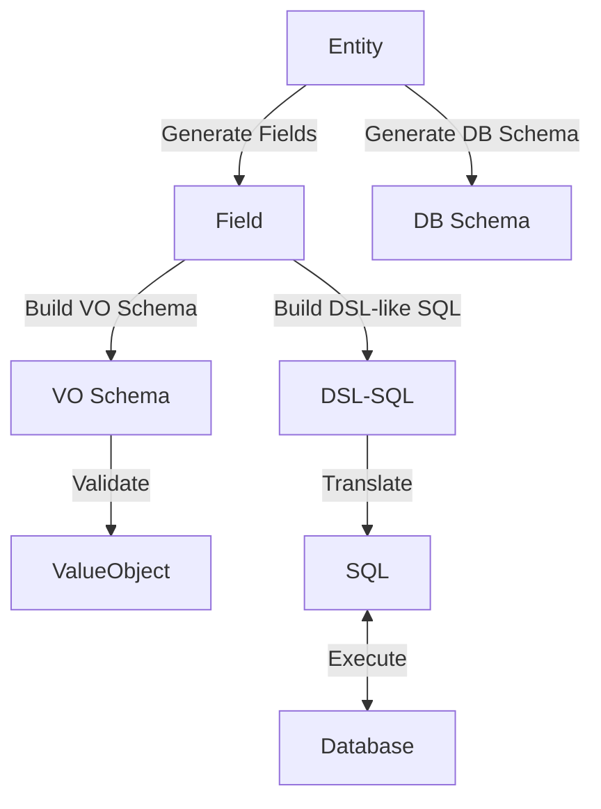

## Goal
Single source of the truth

At first I built `vo.go` mainly for ViewObject (View Layer System) validation and generation.
Later I found that if `Field` is generated from `Entity`, then the same `Field` set can also be used to build a DSL-like SQL layer for persistence.

So we can achieve a single source of truth, as the diagram below shows:

- Generate Fields based on Entity
- Generate DB schema based on Entity
- Build VO schema (ViewObject / validation schema) based on Fields
- Build DSL-like SQL via Fields
- Translate DSL-like SQL to real SQL
