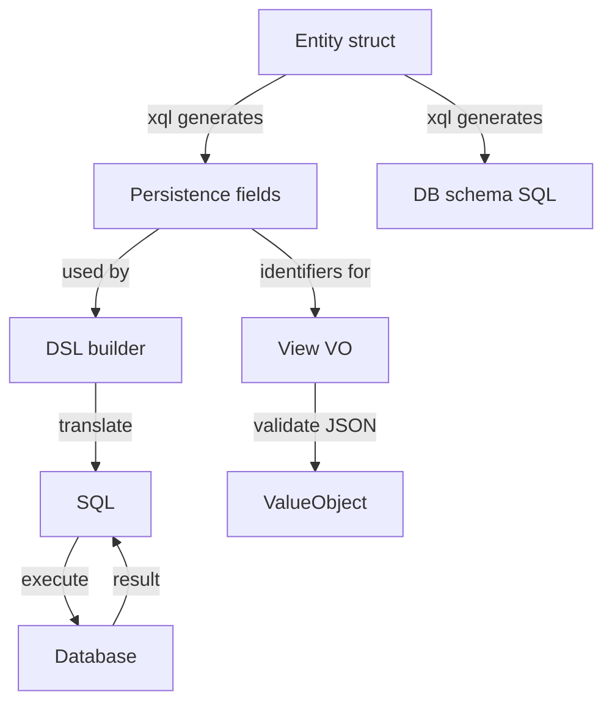

# Phrase 2 Task Plan — Introduce `view` layer and decouple validation

## Goal
Make validation **view-layer only**, while persistence/schema/DSL stay independent of JSON validation internals.

- Persistence (`entity`, `sqlx`, generators) must **not** depend on heavy validation logic.
- View layer defines validation contracts in `view.vo` (schemas) and validates incoming JSON.
- View schemas should be able to **reuse generated fields** (e.g. `sample/gen/field/account/account_gen.go`) as the canonical field identifiers.

## Desired architecture (single source of truth, layered)

### Layer responsibilities
1. **Core field identity layer** (new, tiny)
   - Defines what a "field" *is* for **both** persistence and view.
   - Must not import `gjson` nor validators.

2. **Persistence layer** (`entity`, `sqlx`, `cmd/gob/xql`)
   - Works with the core field identity.
   - Adds persistence metadata (e.g. table name / `QualifiedName()`).

3. **View layer** (new package `view`)
   - Owns validation logic:
     - `Schema` / VO definition
     - parsing input (`gjson`, url/query merge)
     - validators
     - `ValueObject` getters
   - View-layer schema definition is explicit (declared in `view.vo`).

## Current state (what we have)
- `vo.go` in package `dvo` currently mixes:
  - field definition & schema building
  - JSON parsing/validation engine
  - `ValueObject` implementation
- `entity.Field` wraps `dvo.Field(...)` to create persistence fields, meaning persistence currently depends on view/validation field implementation.
- Generator (`cmd/gob/xql`) generates `*_gen.go` field packages that currently wrap `entity.Field[...]`.

## Target state (what we want)
- Introduce a dedicated package `view` for validation.
- Split "field identity" away from view validation.
- Allow `view` schemas to consume generated persistence fields as **identifiers**, without importing persistence-only features.

## Contract sketch (to confirm during implementation)
### Core field identity (new)
- `type FieldRef interface { Name() string }`
  - Minimal and stable.

### Persistence fields
- `entity.FieldProvider[E]` implements `FieldRef` and adds:
  - `QualifiedName() string`

### View schema
- `view.WithFields(...)` accepts wrappers that reference `FieldRef`.
- Validation rules live in view VO definitions, e.g.
  - `view.Required(account.Email, constraint.Email())`
  - `view.Optional(account.Nickname)`

> Important: **required/optional and validators belong to view**, not persistence.

## Implementation steps (incremental, keep tests green)

> Updated plan (per your latest refactor proposal):
> 1) finish DSL -> SQL -> DB first, 2) keep `vo` stable, 3) introduce `meta` between persistence fields and (dsl/view), 4) migrate core code from `vo.go` to `meta`, 5) adapt DSL and keep SQL tests green, 6) introduce `view` package without breaking `vo.go`.

### Step 1 — Finish DSL builder → SQL → Database (feature completion)
- [ ] Implement the SQL DSL pipeline end-to-end based on the **current** generated persistence fields + schema outputs.
- [ ] Lock in tests:
  - [ ] DSL → SQL unit tests (no DB connection)
  - [ ] SQL → DB integration tests (start with sqlite for speed)
- [ ] Ensure field ordering + PK rules are stable and covered by tests.

### Step 2 — Keep current `vo` unchanged (stability guard)
- [ ] Treat existing `vo.go` behavior/API as the compatibility contract.
- [ ] Keep `vo_test.go` and existing middleware tests (gin/echo/fiber) green while implementing Step 1.

### Step 3 — Introduce new core library: `meta` (between persistence fields and dsl/view)
- [ ] Create package `meta` that sits between:
  - persistence fields (`entity.FieldProvider`) and
  - consumers (`sqlx` DSL + future `view`)
- [ ] `meta` responsibilities (keep tiny):
  - [ ] stable field identity (e.g. `FieldRef`), field lists, embedded struct expansion, ordering policy
  - [ ] reusable reflection-derived metadata (but **no** JSON parsing, **no** validators)

### Step 4 — Migrate `vo.go` “core” pieces into `meta`
- [ ] Identify the parts of `vo.go` that are not view-specific (field identity / meta-model / reusable structure).
- [ ] Move those parts into `meta`.
- [ ] Keep `vo.go` compiling and passing tests by delegating or wrapping.

### Step 5 — Adapt DSL to use `meta` and ensure SQL tests stay green
- [ ] Refactor SQL builder (`sqlx` and related packages) to depend on `meta` primitives.
- [ ] Keep all SQL/DSL tests passing throughout.
- [ ] Ensure persistence generation does not pick up view-only concerns.

### Step 6 — Create `view` package for validation only (no breaking change)
- [ ] Create a new `view` package that contains:
  - [ ] JSON parsing (`gjson`), validation engine, schema/rules, `ValueObject`
- [ ] Use `meta.FieldRef` (or equivalent) as the linking contract.
- [ ] Keep `vo.go` as a façade for compatibility:
  - [ ] `dvo.*` delegates to `view.*` where appropriate
  - [ ] do not force end users to change imports immediately

## Test strategy
- Keep existing unit tests green by introducing compatibility shims first.
- Add new tests:
  - View layer can validate JSON using generated fields as identifiers.
  - Persistence layer can build SQL DSL using generated fields without importing view.

## Risks / decisions needed
- **Naming**: `view.Schema` vs `view.VO` (VO is the contract, Schema looks generic).
- **Field naming policy mismatch** between DB columns and JSON keys:
  - If they differ, view needs `Rename()` capability.
- **Optional/Required semantics**:
  - View contracts vary per endpoint; should not mutate global generated fields.

## Deliverables
- `view` package with validation only.
- `meta` (core library) for shared field identity and metadata.
- `entity` and generator updated to depend on the shared meta layer.
- Updated docs and sample usage demonstrating:
  - Entity → generated fields → view VO → validation
  - Entity → generated fields → schema/SQL

